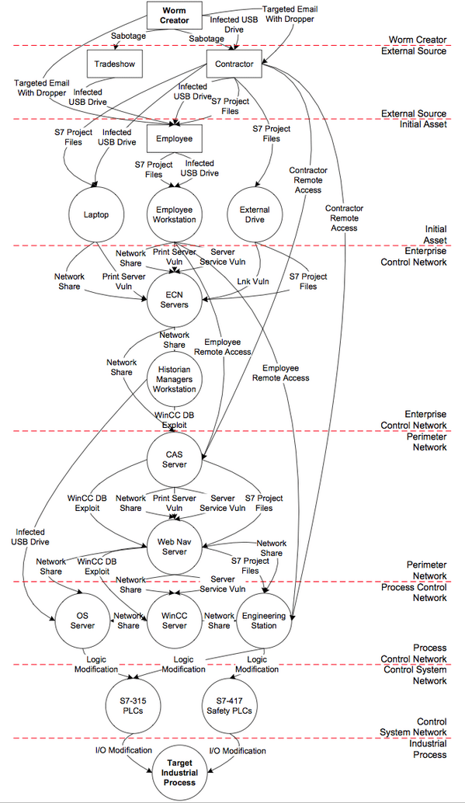

# Py4CSKG
This is a python project for creating CyberSecurity Knowledge Graph (CSKG) developed and maintained by Kuromesi, graduate student of School of Systems and Science Engineering, Sun Yat-sen University.

## USAGE
### SOME SPACY COMMANDS
`spacy train config.cfg --output ./output --gpu-id 0`
`spacy convert ./train.conll . -s -n 10`
`spacy evaluate output/model-best/ dev.spacy --gpu-id 0`

## DEMONSTRATIONS
### FIND HIDDEN RELATIONS
PHP remote file inclusion vulnerabilities CVE-2007
CVE-2012-5970
obtain sensitive information CVE-2007
CVE-2021-0109 Insecure inherited permissions

### FIND RELATED ATTACK PATTERNS
CVE-2021-36758
CVE-2021-21482

## FIND RELATED WEAKNESSES
CVE-2021-0056 Insecure inherited permissions
CVE-1999-0003 CWE-119 CVE-1999-0027
CVE-2019-5314 CWE-74

## NEO4J COMMANDS
docker run -it --rm -v /shared/databases/neo4j/data/:/data neo4j:latest \
neo4j-admin database import full --overwrite-destination \
--nodes=/data/import/capec_pt.csv --nodes=/data/import/capec_misc.csv \
--nodes=/data/import/attack_tech.csv --nodes=/data/import/attack_misc.csv \
--nodes=/data/import/cwe_wk.csv --nodes=/data/import/cwe_misc.csv \
--relationships=/data/import/capec_rel.csv --relationships=/data/import/cwe_rel.csv --relationships=/data/import/attack_rel.csv \
--multiline-fields=true --ignore-empty-strings=true --skip-duplicate-nodes=true
--skip-bad-relationships=true --skip-duplicate-nodes=true

docker run -it --rm -v /shared/databases/neo4j/data/:/data neo4j:latest \
neo4j-admin database import full --overwrite-destination \
--nodes=/data/import/nodes/capec_pt.csv --nodes=/data/import/nodes/capec_misc.csv \
--nodes=/data/import/nodes/attack_tech.csv --nodes=/data/import/nodes/attack_misc.csv \
--nodes=/data/import/nodes/cwe_wk.csv --nodes=/data/import/nodes/cwe_misc.csv \
--nodes=/data/import/nodes/cve_cve.*.csv --nodes=/data/import/nodes/cve_cpe.*.csv \
--relationships=/data/import/relations/.*.csv \
--multiline-fields=true --ignore-empty-strings=true --skip-duplicate-nodes=true --skip-bad-relationships=true --auto-skip-subsequent-headers=true

docker run -it --rm -v /shared/databases/neo4j/data/:/data neo4j:latest \
neo4j-admin database import full --overwrite-destination \
--nodes=/data/import/nodes/.*.csv \
--relationships=/data/import/relations/.*.csv \
--multiline-fields=true --ignore-empty-strings=true --skip-duplicate-nodes=true --skip-bad-relationships=true --auto-skip-subsequent-headers=true

docker run -it --rm -v /shared/databases/neo4j/data/:/data neo4j:latest \
neo4j-admin database import full --overwrite-destination \
--nodes=/data/import/nodes/cve_cve.*.csv --nodes=/data/import/nodes/cve_cpe.*.csv \
--multiline-fields=true --ignore-empty-strings=true --skip-duplicate-nodes=true --skip-bad-relationships=true --auto-skip-subsequent-headers=true

docker run -it --rm -v /home/kuromesi/MyCOde/kuromesi.com/Py4CSKG/data/neo4j/data:/data neo4j:latest \
neo4j-admin database import full --overwrite-destination \
--nodes="/data/import/nodes/attack_misc.*.csv" --nodes="/data/import/nodes/attack_tech.*.csv" \
--nodes="/data/import/nodes/capec_misc.csv" --nodes="/data/import/nodes/capec_pt.csv" \
--nodes="/data/import/nodes/cve_cpe.csv" --nodes="/data/import/nodes/cve_cve.*.csv" \
--nodes=/data/import/nodes/cwe_wk.csv --nodes=/data/import/nodes/cwe_misc.csv \
--relationships="/data/import/relations/.*.csv" \
--multiline-fields=true --ignore-empty-strings=true --skip-duplicate-nodes=true \
--skip-bad-relationships=true --bad-tolerance=200000 \
--auto-skip-subsequent-headers=true neo4j

docker run \
    --name neo4j \
    -p7474:7474 -p7687:7687 \
    -itd \
    -v /home/kuromesi/MyCOde/kuromesi.com/Py4CSKG/data/neo4j/data:/data \
    -v /home/kuromesi/MyCOde/kuromesi.com/Py4CSKG/data/neo4j/logs:/logs \
    -v /home/kuromesi/MyCOde/kuromesi.com/Py4CSKG/data/neo4j/import:/var/lib/neo4j/import \
    -v /home/kuromesi/MyCOde/kuromesi.com/Py4CSKG/data/neo4j/plugins:/plugins \
    --env NEO4J_AUTH=neo4j/password \
    --env NEO4J_PLUGINS='["graph-data-science"]' \
    neo4j:latest

MATCH (p:Person)-[:LIKES]->(cuisine)
WITH {item:id(p), categories: collect(id(cuisine))} as userData
WITH collect(userData) as data
CALL algo.similarity.jaccard.stream(data)
YIELD item1, item2, count1, count2, intersection, similarity
RETURN algo.getNodeById(item1).name AS from, algo.getNodeById(item2).name AS to, intersection, similarity
ORDER BY similarity DESC

### FULL-TEXT INDEX
CREATE FULLTEXT INDEX vulDes FOR (n:Vulnerability) ON EACH [n.description]

CALL db.index.fulltext.queryNodes("vulDes", "sql injection") YIELD node, score
RETURN node.id, node.description, score limit 25

### DELETE DUPLICATE RELATIONS
match ()-[r]->() 
match (s)-[r]->(e) 
with s,e,type(r) as typ, tail(collect(r)) as coll 
foreach(x in coll | delete x)

### NODE SIMILARITY
CALL gds.graph.project('my-graph-projection', ['Vulnerability','Weakness', 'Platform'], [{Observed_Example: {orientation: 'UNDIRECTED'}}, 'Has_Platform']);

## RULES
[]: represent list
(): represent nodes, id etc. e.g. (component), (component.id)
    ontology:
        component, firmware, hardware, software, os, entry
{}: represent functions
    \#: defend, this comonent is designed to perform some defensive functions ,e.g. #{component.*} which means restrict access of all nodes
    @: compromised, 
    ->: lead to
    <-: require
    !: not, disable some functions, e.g. @(software.id)->!#{component*}
    <=>: communicate
$: asset, default values are userPrivilege, rootPrivilege, appPrivilege, appCodeExec, systemCodeExec

some examples:
    (\$<appPrivilege>)<-@->(:<component>.<firewall>)!\#(component.*)
    \#(:<entry>.<id>)

## ATTACK EXAMPLES
### wannacry 
CVE-2017-0144 System arbitrary code execution 
https://success.trendmicro.com/dcx/s/solution/1117391-preventing-wannacry-wcry-ransomware-attacks-using-trend-micro-products?language=en_US&sfdcIFrameOrigin=null

### Stuxnet
CVE-2010-2568 Code Execution (Windows Shell in Microsoft Windows XP SP3, Server 2003 SP2, Vista SP1 and SP2, Server 2008 SP2 and R2, and Windows 7 allows local users or remote attackers to execute arbitrary code via a crafted (1) .LNK or (2) .PIF shortcut file, which is not properly handled during icon display in Windows Explorer, as demonstrated in the wild in July 2010, and originally reported for malware that leverages CVE-2010-2772 in Siemens WinCC SCADA systems.)
CVE-2010-2772 Privilege Escalation (Siemens Simatic WinCC and PCS 7 SCADA system uses a hard-coded password, which allows local users to access a back-end database and gain privileges, as demonstrated in the wild in July 2010 by the Stuxnet worm, a different vulnerability than CVE-2010-2568.)
CVE-2008-4250 Overflow, Code Execution (The Server service in Microsoft Windows 2000 SP4, XP SP2 and SP3, Server 2003 SP1 and SP2, Vista Gold and SP1, Server 2008, and 7 Pre-Beta allows remote attackers to execute arbitrary code via a crafted RPC request that triggers the overflow during path canonicalization, as exploited in the wild by Gimmiv.A in October 2008, aka "Server Service Vulnerability.")
CVE-2010-2729 Code Execution (The Print Spooler service in Microsoft Windows XP SP2 and SP3, Windows Server 2003 SP2, Windows Vista SP1 and SP2, Windows Server 2008 Gold, SP2, and R2, and Windows 7, when printer sharing is enabled, does not properly validate spooler access permissions, which allows remote attackers to create files in a system directory, and consequently execute arbitrary code, by sending a crafted print request over RPC, as exploited in the wild in September 2010, aka "Print Spooler Service Impersonation Vulnerability.")
CVE-2010-2743 Privilege Escalation (The kernel-mode drivers in Microsoft Windows XP SP3 do not properly perform indexing of a function-pointer table during the loading of keyboard layouts from disk, which allows local users to gain privileges via a crafted application, as demonstrated in the wild in July 2010 by the Stuxnet worm, aka "Win32k Keyboard Layout Vulnerability."  NOTE: this might be a duplicate of CVE-2010-3888 or CVE-2010-3889.)
CVE-2010-2549 Denial of Service, Privilege Escalation (Use-after-free vulnerability in the kernel-mode drivers in Microsoft Windows Vista SP1 and SP2 and Server 2008 Gold and SP2 allows local users to gain privileges or cause a denial of service (system crash) by using a large number of calls to the NtUserCheckAccessForIntegrityLevel function to trigger a failure in the LockProcessByClientId function, leading to deletion of an in-use process object, aka "Win32k Reference Count Vulnerability.")
CVE-2010-2744 Privilege Escalation (The kernel-mode drivers in Microsoft Windows XP SP2 and SP3, Windows Server 2003 SP2, Windows Vista SP1 and SP2, Windows Server 2008 Gold, SP2, and R2, and Windows 7 do not properly manage a window class, which allows local users to gain privileges by creating a window, then using (1) the SetWindowLongPtr function to modify the popup menu structure, or (2) the SwitchWndProc function with a switch window information pointer, which is not re-initialized when a WM_NCCREATE message is processed, aka "Win32k Window Class Vulnerability.")
CVE-2010-3338 Privilege Escalation (The Windows Task Scheduler in Microsoft Windows Vista SP1 and SP2, Windows Server 2008 Gold, SP2, and R2, and Windows 7 does not properly determine the security context of scheduled tasks, which allows local users to gain privileges via a crafted application, aka "Task Scheduler Vulnerability." NOTE: this might overlap CVE-2010-3888.)
CVE-2012-3015 Privilege Escalation (Untrusted search path vulnerability in Siemens SIMATIC STEP7 before 5.5 SP1, as used in SIMATIC PCS7 7.1 SP3 and earlier and other products, allows local users to gain privileges via a Trojan horse DLL in a STEP7 project folder.)

### Ukraine power grid
CVE-2014-4114 System arbitrary code execution 
https://www.boozallen.com/content/dam/boozallen/documents/2016/09/ukraine-report-when-the-lights-went-out.pdf

## CVE CLASSIFICATION
CVE-2020-10814 N/N/P Code exec/Application crash https://sourceforge.net/p/codeblocks/tickets/934/
CVE-2020-10374 P/P/P Code exec/Chromium engine to create the screenshot https://kb.paessler.com/en/topic/87668-how-can-i-mitigate-cve-2020-10374-until-i-can-update
CVE-2020-10214 C/C/C Code exec/Any code https://github.com/kuc001/IoTFirmware/blob/master/D-Link/vulnerability4.md